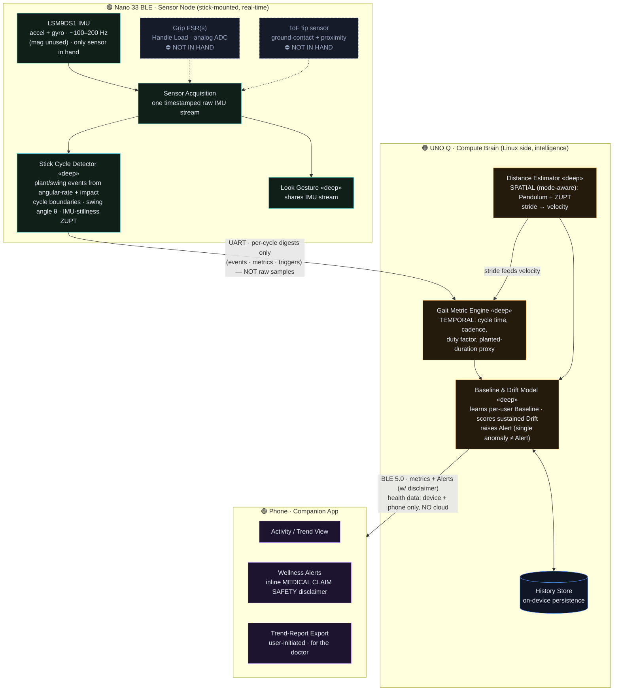
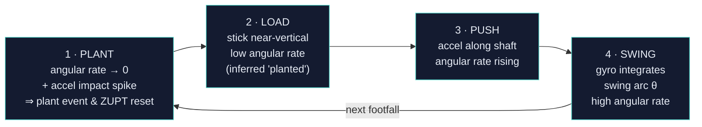
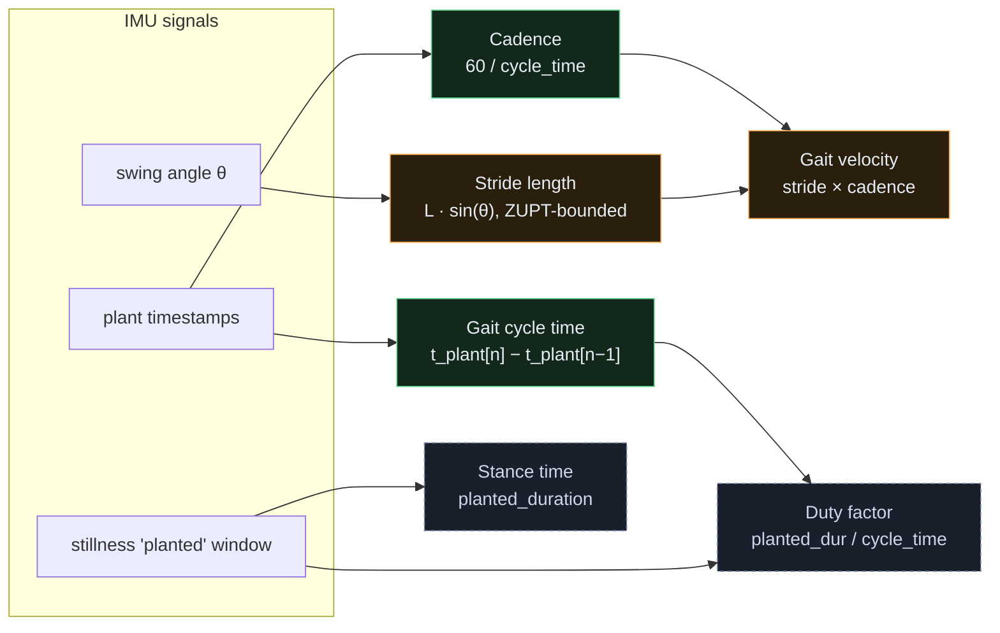

# Moon Walk — Gait-Sensing Architecture (IMU-only build)

> **Current build = IMU-only.** The only sensor in hand is the Arduino Nano 33 BLE's
> onboard **LSM9DS1 IMU**. The designed multi-FSR **Handle Load** grip and the **ToF**
> tip sensor (CONTEXT.md / ADR-0002) are *not yet acquired* (shown dashed below).
> All six metrics derive from the IMU alone; FSR & ToF are optional upgrades.
> See the styled version in [`architecture.html`](./architecture.html).

## 1. System pipeline — sensor → metrics → app

## 2. One Stick Cycle — what the IMU sees (no force sensor)

## 3. The six metrics — module, signal, formula, tier

**Tiers** — 🟢 absolute (Tier 1): cycle time, cadence · 🟠 trend-only (Tier 2): stride length, velocity · ⚪ IMU-inferred (would become Tier 1 with an FSR): duty factor, stance time.
