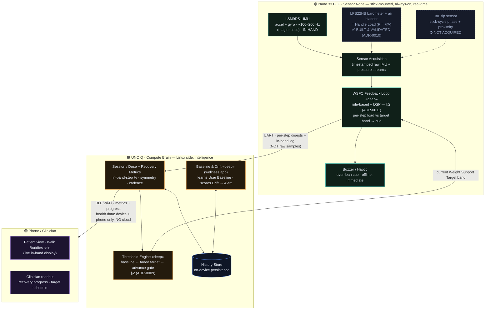
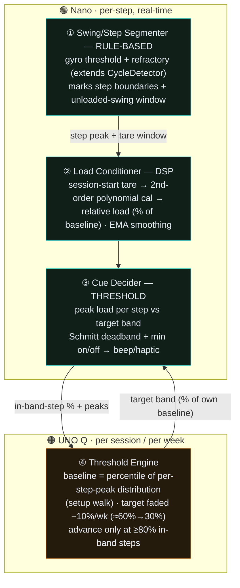
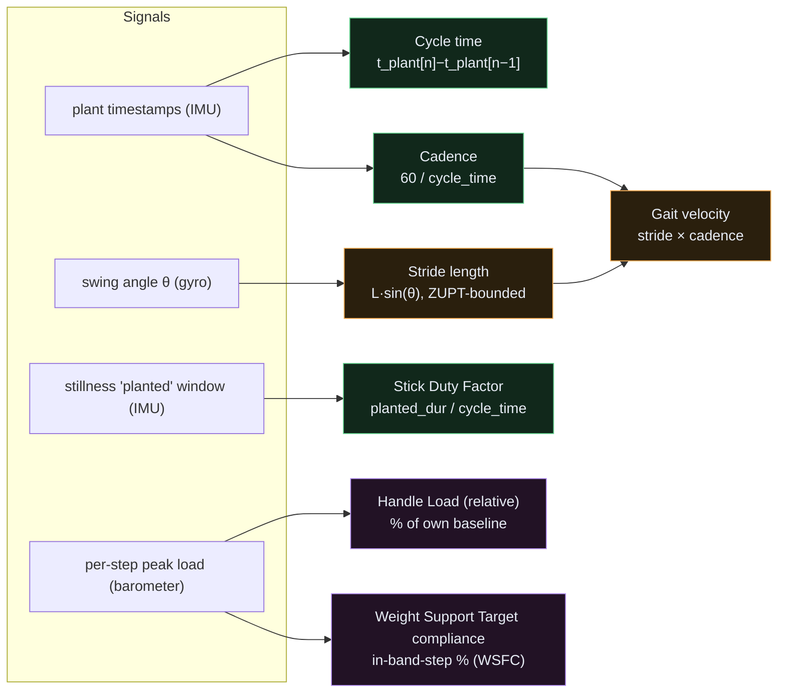
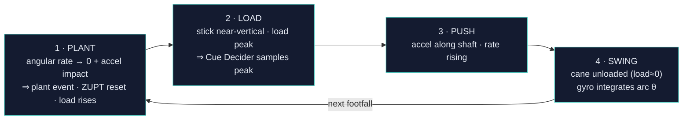

# Moon Walk — Architecture (WSFC flagship)

> Moon Walk is **one clip-on sensor running several applications** ([ADR-0009]). The
> **flagship is the Weight Support Feedback Cane (WSFC)**: a real-time weight-support
> biofeedback loop that retrains a rehab **Patient** to load the affected leg instead of
> over-leaning on the cane. **Wellness gait-monitoring** and the **Speaking Stick** are
> secondary applications on the same hardware. This doc describes the runtime architecture;
> the *why* lives in the ADRs linked throughout.
>
> **Hardware reality (2026-05-27).** *In hand & working:* the Arduino Nano 33 BLE's onboard
> **LSM9DS1 IMU** and **LPS22HB barometer**, plus the pneumatic **Handle Load** bladder —
> now **built, bench-calibrated, and drift/hysteresis-validated** ([ADR-0010]). *Not acquired:*
> the **ToF Distance** tip sensor. Not-acquired blocks are dashed below.
>
> The styled [`architecture.html`](./architecture.html) is the rendered companion to this
> file — keep the two in sync (edit here, regenerate there).

## 1. Two boards, one sensor ([ADR-0004])

**Split rationale:** the **cue must be immediate and offline**, so the WSFC Feedback Loop
runs on the always-on Nano; the **Threshold Engine** (which only needs to update the target
band per session/week) runs on the UNO Q's Linux side alongside history and the wellness
intelligence. *Dev transport:* before the UART link exists, the Nano streams IMU over BLE to
a local hub → WebSocket → dashboard/Walk Buddies (`realtime/hub.py`, [ADR-0007]).

## 2. The WSFC real-time loop — rule-based + DSP ([ADR-0011])

The flagship loop is **rule-based + DSP, not ML.** It decomposes into three on-device modules
plus the per-session Threshold Engine. ML is a *deferred, named fallback for segmentation
only* — never in the cue decision, never classifying "abnormal"/"fall-risk".

**Tare strategy ([ADR-0010], amended).** The WSFC application tares the barometer **once at
session start, after a brief grip/thermal equilibration**, with a clinician one-button
manual re-zero — *not* the per-swing auto-tare (that is rescoped to the long, unsupervised
wellness application). The Segmenter's swing detection is used for **step segmentation only**,
**decoupled from the load zero**, so a missed swing cannot inject a bad re-zero into a safety
cue. Because the target is a % of a baseline measured *in the same session after
equilibration*, slow common-mode drift largely cancels in the ratio.

**Claim-safety binds the loop ([ADR-0009]).** The target is always **% of the Patient's own
baseline cane-dependence — never %-body-weight, never an absolute-force claim**; kgf is
bench-calibration / optional clinician readout only. No diagnosis, no fall-risk.

## 3. Sensor → signal → metric

**Tiers** ([`docs/FEATURES.md`] §2) — 🟢 Tier 1 reliable (temporal): cycle time, cadence,
Stick Duty Factor · 🟠 Tier 2 trend-only (spatial): stride length, velocity · 🟪 Tier 3
relative/per-user (loading): Handle Load, Weight Support Target compliance — **WSFC's headline
signals**, now unblocked (pneumatic sensor built & validated, [ADR-0010]).

## 4. One Stick Cycle — what the sensors see

The **LOAD** phase peak is where the Cue Decider makes its once-per-step in-band/out-of-band
decision; the **SWING** phase (cane in air, load ≈ 0) is the natural reference the wellness
app uses for per-swing re-zeroing (WSFC re-zeros once per session instead — §2).

## 5. Secondary applications (same hardware)

- **Wellness gait monitoring** ([ADR-0001], [ADR-0005]) — the UNO Q learns the User's
  **Baseline** and scores sustained **Drift** to raise a non-medical **Alert** (single
  anomaly ≠ Alert). Measure-and-trend only; uses the Tier 1/2 metrics, no real-time cue
  unless **Training Mode** is opted in ([ADR-0006]). Per-swing auto-tare lives here.
- **Speaking Stick** ([ADR-0003]) — orthogonal see-and-speak layer: camera → cloud VLM →
  TTS, plus an offline **Proximity Alert** (gated on the ToF). Not part of the WSFC story.

## 6. What Moon Walk cannot measure

No leg stance time (the handle is loaded, not the foot), no ground reaction force, no absolute
force / Newtons, no %-body-weight, no diagnosis, no fall-risk. These bind **all** applications
([`docs/FEATURES.md`] §"cannot measure", CONTEXT.md **Claim Safety**).

---

[ADR-0001]: ./adr/0001-measure-and-trend-not-diagnostic.md
[ADR-0003]: ./adr/0003-add-see-and-speak-assistive-layer.md
[ADR-0004]: ./adr/0004-two-board-uno-q-brain-nano-sensor-node.md
[ADR-0005]: ./adr/0005-wellness-positioning-and-claim-safety-vocabulary.md
[ADR-0006]: ./adr/0006-opt-in-training-mode-coaching-cue.md
[ADR-0007]: ./adr/0007-local-websocket-transport-for-dashboard-demo.md
[ADR-0009]: ./adr/0009-pivot-to-weight-support-feedback-cane.md
[ADR-0010]: ./adr/0010-pneumatic-barometer-handle-load.md
[ADR-0011]: ./adr/0011-wsfc-real-time-processing-rule-based-dsp.md
[`docs/FEATURES.md`]: ./FEATURES.md
